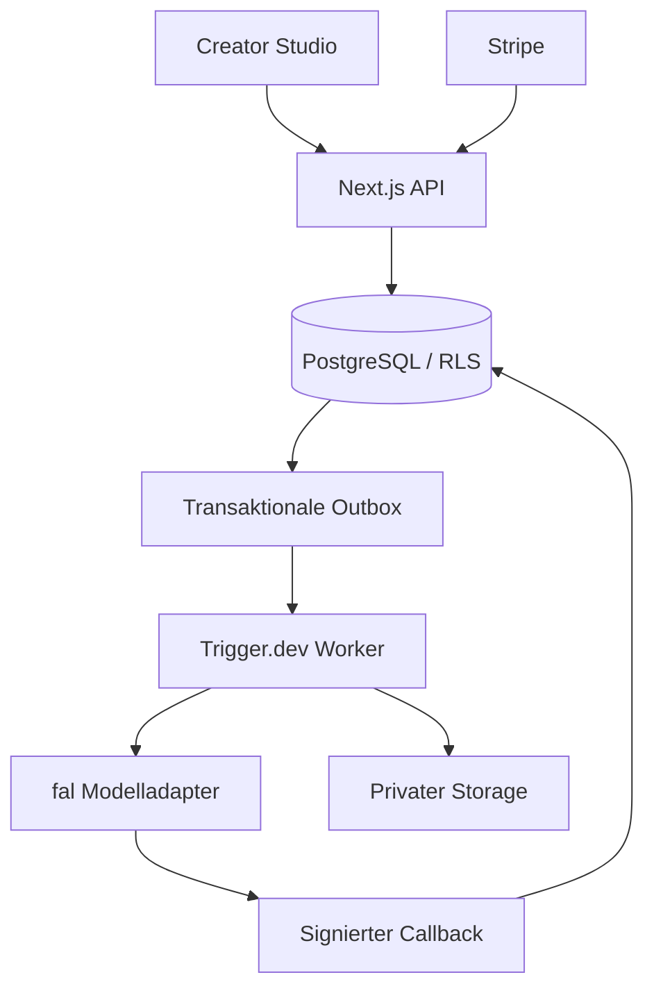
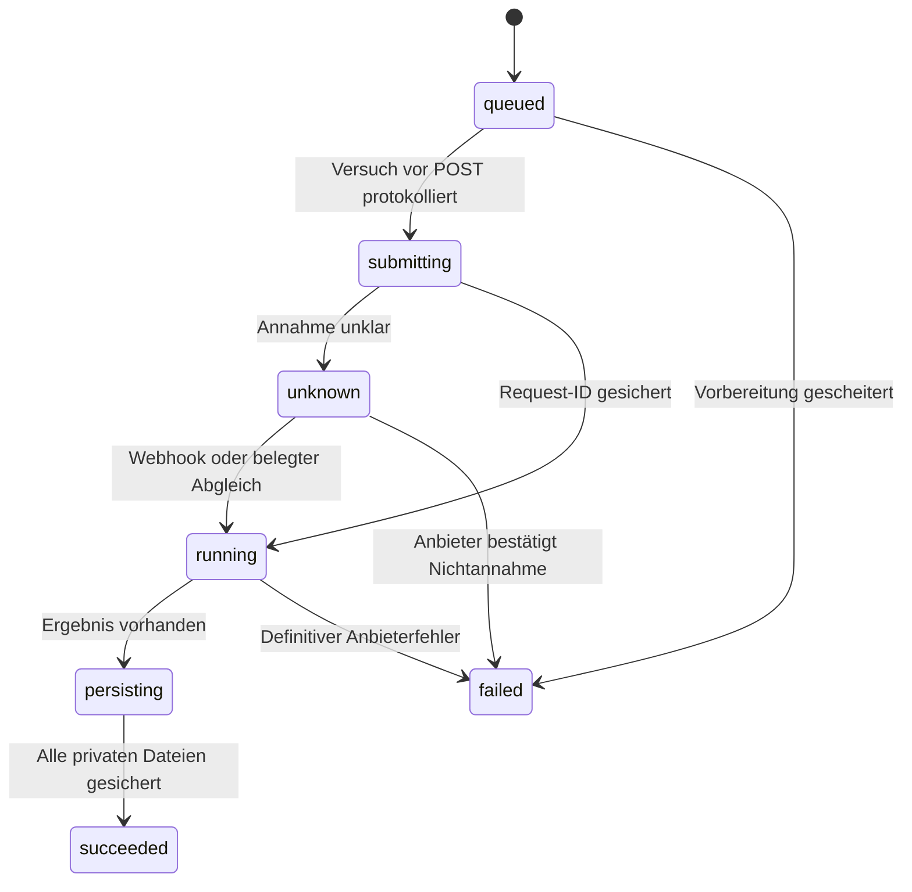

# Architektur

Die Anwendung ist ein modularer Monolith mit zwei Laufzeiten: Next.js für Auth, Produktoberfläche und kurze API-Aufrufe; Trigger.dev für Medienverarbeitung und Wiederanlauf. PostgreSQL ist die Wahrheit für Rechte, Jobs, Kosten und Credits. Keine zusätzliche Queue-Datenbank, Redis oder öffentliche Medien-CDN.

## Module

| Pfad                   | Verantwortung                                                            |
| ---------------------- | ------------------------------------------------------------------------ |
| `src/domain`           | Validierung, versionierte Preislogik, Modellfähigkeiten, reine Typen     |
| `src/server/providers` | Typisierte fal-Eingaben, Ergebnisvalidierung, Fehlerklassen, Signaturen  |
| `src/server/media`     | Dateiinspektion, FFmpeg, Trainings-ZIP, SSRF-Schutz, private Speicherung |
| `src/server/worker.ts` | Ein Versuch pro Job, Wiederaufnahme, Ergebnissicherung, Settlement       |
| `src/server/billing`   | Autoritative Stripe-Prüfung und Inbox-Wiederaufnahme                     |
| `src/trigger`          | Getrennt ausgeführte Tasks und Zeitpläne                                 |
| `src/components`       | Zugängliche native Formulare/Dialoge, gemeinsamer Charakterzustand       |
| `supabase/migrations`  | Tabellen, RLS, private Buckets, Sperren und serviceexklusive RPCs        |

## Identität und Versionen

Ein Charakter enthält einen bearbeitbaren Entwurf der bestätigten Identitäts- und Körpermerkmale. Referenzen haben Ansicht, Caption, Freigabe, Herkunft, `contain`/`cover` und Zuschnittbestätigung. Automatisch erzeugte Bilder werden nie selbständig freigegeben oder als Trainingsdaten ergänzt.

Das Angebot friert Identität, Referenzen und Parameter ein. Beim Start prüft SQL, ob Freigaben/Captions/Zuschnitte noch übereinstimmen. Jede Training-Version erhält einen Datensatz-Snapshot, eigene Parameter, einen stabilen Triggerbegriff und später private Gewichte/Konfiguration. Der ZIP-Builder schreibt pro Bild eine Caption mit vorangestelltem Triggerbegriff, deaktiviert Auto-Captioning und bereitet den bestätigten quadratischen Zuschnitt selbst vor. Die fertige LoRA-Inferenz verwendet den Identitätsstand der trainierten Version; spätere Profiländerungen ändern alte Versionen nicht.

## Auftragszustände

Ein Worker erhält eine zehnminütige Lease. Eine vorhandene Versuchzeile verhindert jeden zweiten bezahlten POST, auch wenn der Prozess zwischen Journal-Eintrag und Request stirbt. Dieser seltene Fall bleibt bis zur verifizierten Rückmeldung oder manuellen Klärung reserviert. Ohne serverseitigen Anbieter-Idempotenzvertrag ist automatisches „genau einmal“ über die Netzwerkgrenze nicht ehrlich garantierbar; das System bevorzugt sichere Kostenbegrenzung vor automatischem Neustart.

Deterministische Ergebnis-IDs dienen als dauerhafte Speicherbelege. Ein Neustart überspringt bereits gespeicherte Ausgaben und setzt die Verarbeitung fort. Das SQL-Settlement prüft terminalen Anbieterstatus und passende Dateien; ein Trainingsarchiv allein ist kein erfolgreiches Training.

## Grenzen der ersten Version

Ein automatischer privater Workspace pro Anmeldung; das Datenmodell unterstützt mehrere Mitglieder, eine Einladungsoberfläche ist noch nicht enthalten. Bibliothek lädt die jüngsten 200 Assets, Jobliste 50, Admin 100. Für grössere Archive ist cursorbasierte Pagination nachzurüsten. Das ist eine bewusst begrenzte frühe Produktversion; die gespeicherten älteren Daten gehen nicht verloren.

## Vercel-Erweiterung (7. September 2026)

`upload_intents` bildet private Dateiübertragungen unabhängig von kostenpflichtigen Modelljobs ab. Vercel stellt nach Nutzerprüfung ein Token aus; Supabase nimmt Bytes direkt an. Der Trigger-Task `media-upload` prüft/normalisiert Dateien. Eine durch Lease geschützte Transaktion veröffentlicht Asset und Fertigstatus zusammen. `recover-uploads` übernimmt Wiederanlauf und Rohdaten-Purge. Die Web-Dispatch-Schicht importiert Worker nur als TypeScript-Typ und startet keine Medienverarbeitung. [Ablauf, Speicherreservierungen und Anbietergrenzen](vercel.md).
