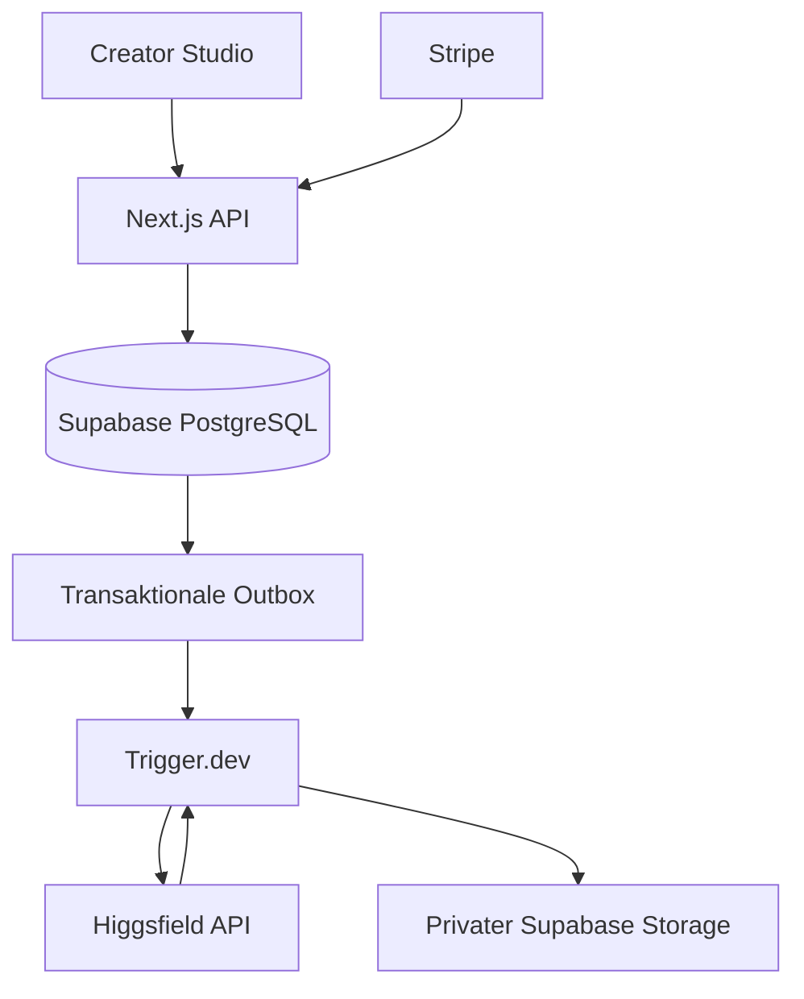

# Architektur

Chriklfield ist ein modularer Monolith mit Next.js für Web/API, Supabase als System of Record und Trigger.dev für langlebige Jobs.

## Provider

Higgsfield ist der einzige Modellprovider. `src/server/providers/higgsfield.ts` kapselt Authentifizierung, Eingabemapping, Statusabfrage und Ergebnisnormalisierung. Die UI kennt keine Provider-Credentials.

Generation ist asynchron. Ein Provider-Versuch wird vor dem kostenpflichtigen POST persistiert. Nach Annahme speichert Chriklfield die Request-ID und prüft den Status serverseitig. Bei unklarer Annahme wird nicht spekulativ ein zweiter kostenpflichtiger POST gesendet.

## Charakteridentität

Eine Character-Version speichert:

- Snapshot von Identitäts- und Körpermerkmalen
- Snapshot der freigegebenen Referenzen
- Higgsfield `provider_reference_id` der Soul ID
- Trainingsstatus und Parameter

Für Soul ID werden 20–80 bestätigte Referenzen verwendet. Fertige Versionen werden bei Charakterbildern über die gespeicherte Provider-Reference-ID wiederverwendet.

## Ergebnisse

Provider-Ergebnisse werden nicht dauerhaft als externe URLs behandelt. Der Worker lädt freigegebene Resultate kontrolliert herunter, normalisiert die Medien und speichert sie im privaten Supabase Storage. Das Ergebnis-Asset wird erst danach als persistiert betrachtet.

## Billing

Quotes verwenden serverseitig geprüfte Modellpreise. Preisstände verfallen nach sieben Tagen. Providerwechsel oder ungeprüfte Preise deaktivieren das jeweilige Modell, bis ein Admin die aktuellen Konditionen bestätigt.

## Sicherheit

Supabase RLS schützt nutzerbezogene Tabellen. Interne Tabellen werden ausschließlich serverseitig verwendet. Provider-Secrets, Service-Role-Key und Stripe-Secrets dürfen nie in `NEXT_PUBLIC_*` Variablen landen.
